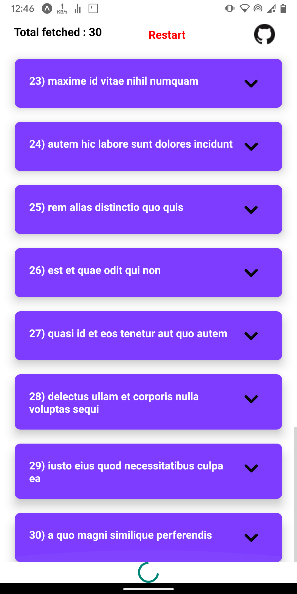
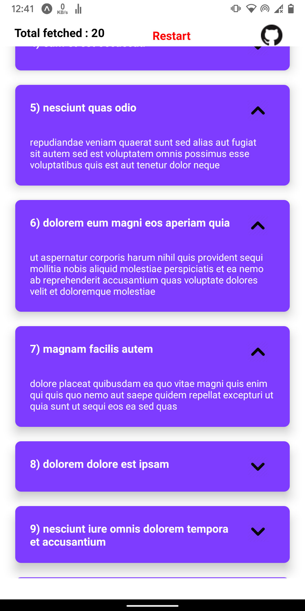

# Fetch data lazily !

### This app fetches data from [JsonPlaceHolder](http://jsonplaceholder.typicode.com/) API.
### The fetch happens in a lazy way ie. a set of 10 elements are fetched and rendered only when the user reaches the end of the list.

## Lazy fetch

## Header has restart button and total components fetched till now count.

## Collapsible cards

